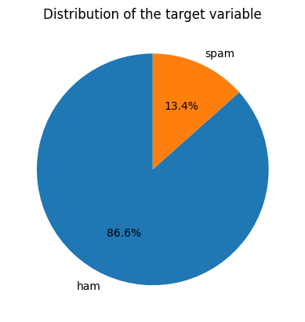
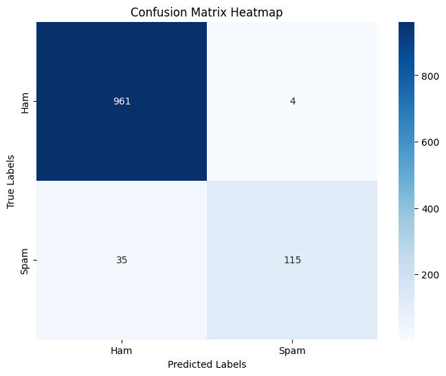
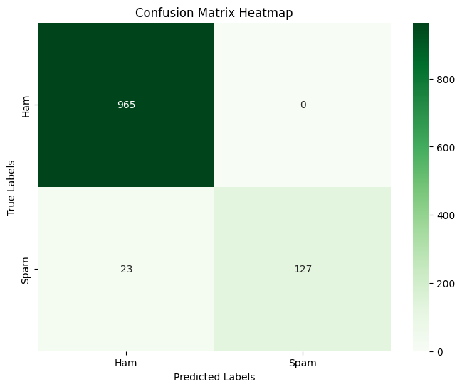

# 📧 Spam Mail Detection

This machine learning project detects spam emails using text classification techniques. It involves preprocessing textual data, converting it to numerical features using TF-IDF vectorization, and training models to classify emails as **spam** or **ham**.

---

## 📁 Dataset

- Source: `spam.csv`
- Total messages: ~5,500
- Labels: `ham`, `spam`
- Features: Email content

---

## 🔍 Techniques Used

- Text Cleaning (lowercase, punctuation removal, stopwords removal)
- Tokenization
- TF-IDF Vectorization
- Label Encoding
- Data Visualization (WordClouds, Pie Charts, Heatmaps)
- Model Evaluation Metrics

---

## 🧠 Models Implemented

| Model                | Description                     |
|---------------------|---------------------------------|
| Logistic Regression | Supervised linear classifier    |
| Naive Bayes         | Probabilistic text classifier   |

---

## 📊 Evaluation Metrics

- Accuracy
- Precision
- Recall
- F1 Score
- Confusion Matrix
- Classification Report

---

## 📈 Visualizations

- Pie Chart of Label Distribution
- WordClouds of Spam & Ham Messages
- Confusion Matrix Heatmaps

> 📸 You can find these visualizations in the `/images` folder.





---

## ⚙️ Installation

1. Clone the repository:
   ```bash
   git clone https://github.com/shahmi0519/Spam-Mail-Detection.git
   cd spam-mail-detection
   ```
2. Install dependencies:
   ```bash
   pip install -r requirements.txt
   ```
3. Run the notebook:
   ```bash
   jupyter notebook notebooks/spam_mail_detection.ipynb
   ```

---

## 📦 Requirements

- pandas
- numpy
- matplotlib
- seaborn
- scikit-learn
- nltk
- wordcloud

---

## 📂 Project Structure
```bash
├── data/                  # Dataset
├── notebooks/             # Jupyter notebooks
├── images/                # Graphs & charts
├── requirements.txt       # Project dependencies
└── README.md              # Project overview
```
---

## ✍️ Author
**Ahamed Shahmi A.J**
- **📧 Mail**: [`shahmiahamed0519@gmail.com`](mailto:shahmiahamed0519@gmail.com)
- **🔗 LinkedIn**: [`Ahamed Shahmi`](https://www.linkedin.com/in/ahamed-shahmi-abduljabbar/)
- **💻 GitHub**: [`shahmi0519`](https://github.com/shahmi0519)
---

## 📝 License
This project is licensed under the MIT License – see the [LICENSE](LICENSE) file for details.
